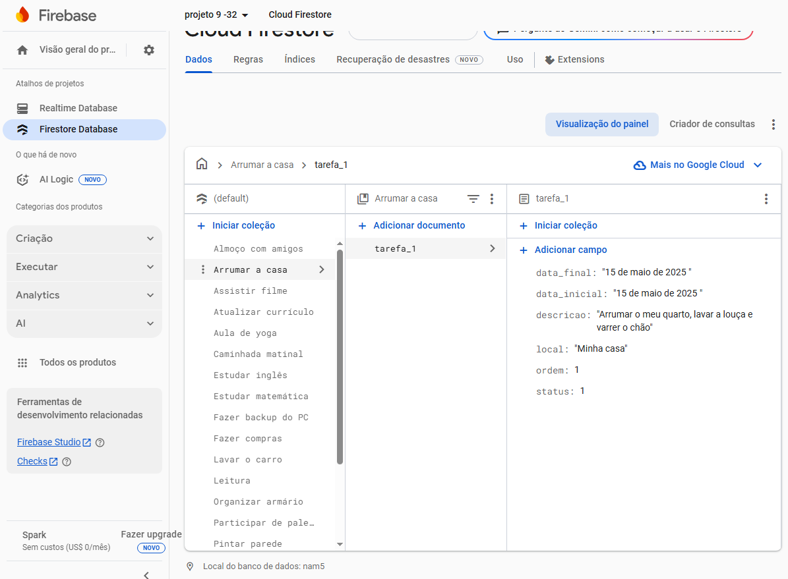
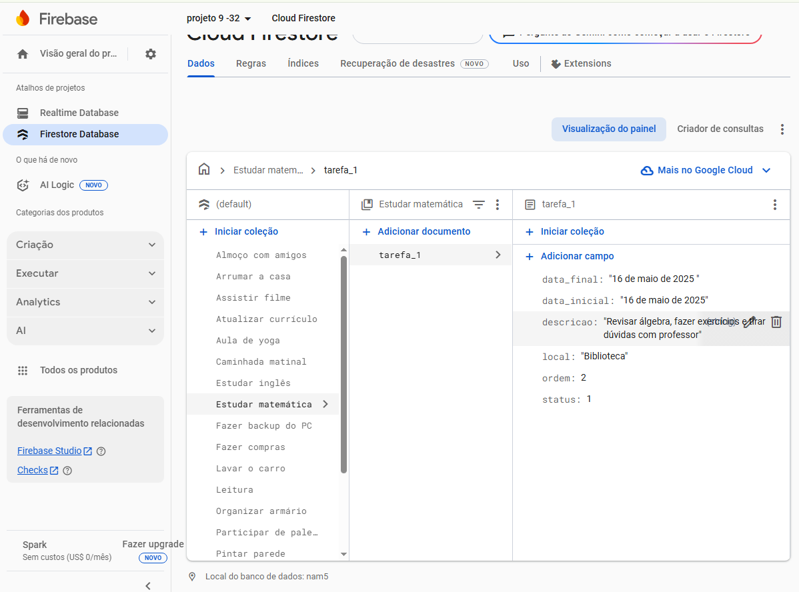

#  Projeto Firebase Agenda

Este é um projeto de agenda digital utilizando o **Cloud Firestore**, banco de dados em tempo real da plataforma **Firebase**. O objetivo é organizar tarefas diárias por categorias, armazenando dados como datas, descrições, local, ordem e status.

---

##  Estrutura do Projeto

As tarefas são organizadas por **coleções** que representam categorias (por exemplo: *Estudar matemática*, *Arrumar a casa*, etc). Dentro de cada coleção, há documentos com os detalhes das tarefas individuais.

Cada documento (tarefa) possui os seguintes campos:
- `data_inicial`: Data de início da tarefa
- `data_final`: Data limite para conclusão
- `descricao`: Descrição da tarefa
- `local`: Onde a tarefa será realizada
- `ordem`: Ordem de execução (prioridade)
- `status`: Status da tarefa (por exemplo, 1 = ativa)

---

##  Imagens do Projeto

###  Imagem 1: Tarefa "Estudar matemática"

Nesta imagem, a categoria selecionada é **Estudar matemática**. A tarefa registrada é:
- **Descrição:** "Revisar álgebra, fazer exercícios e tirar dúvidas com professor"
- **Data:** 16 de maio de 2025
- **Local:** Biblioteca
- **Ordem:** 2
- **Status:** 1 (ativa)

---

###  Imagem 2: Tarefa "Arrumar a casa"

Nesta imagem, vemos a categoria **Arrumar a casa**. A tarefa armazenada possui:
- **Descrição:** "Arrumar o meu quarto, lavar a louça e varrer o chão"
- **Data:** 15 de maio de 2025
- **Local:** Minha casa
- **Ordem:** 1
- **Status:** 1 (ativa)
